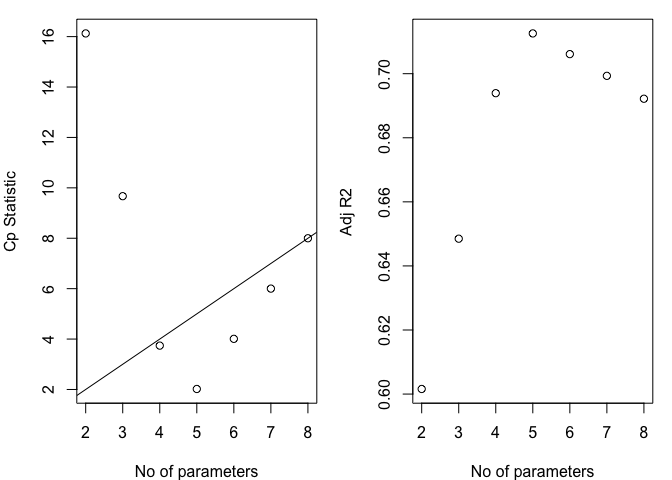
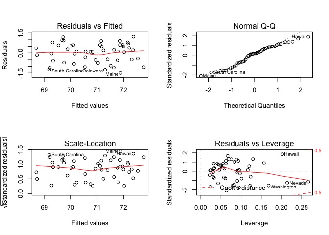

biostatistical methods homework 5
================

``` r
library(knitr)
library(tidyverse)
library(faraway)
library(broom)
library(leaps)
library(boot)
library(modelr)
library(caret)
```

R dataset ‘state.x77’ from library(faraway) contains information on 50 states from 1970s collected by US Census Bureau. The goal is to predict ‘life expectancy’ using a combination of remaining variables.
------------------------------------------------------------------------------------------------------------------------------------------------------------------------------------------------------------

``` r
life_data = as.data.frame(state.x77) %>%
  janitor::clean_names()
```

1. Explore the dataset and generate appropriate descriptive statistics and relevant graphs
------------------------------------------------------------------------------------------

``` r
mean_and_sd = function(x) {
  
  if (!is.numeric(x)) {
    stop("Argument x should be numeric")
  } else if (length(x) == 1) {
    stop("Cannot be computed for length 1 vectors")
  }
  
  mean_x = mean(x)
  sd_x = sd(x)
  tibble(
    mean = mean_x, 
    sd = sd_x
  )
}
```

``` r
attach(life_data)
```

``` r
par(mfrow = c(2, 4))
boxplot(population, main = 'population')
boxplot(income,main = 'income' )
boxplot(illiteracy, main = 'illiteracy')
boxplot(life_exp, main = 'life_exp')
boxplot(murder, main = 'murder')
boxplot(hs_grad, main = 'hs_grad')
boxplot(frost, main = 'frost')
boxplot(area, main = 'area')
```


Population

``` r
summary(population)
```

    ##    Min. 1st Qu.  Median    Mean 3rd Qu.    Max. 
    ##     365    1080    2838    4246    4968   21198

Income

``` r
summary(income)
```

    ##    Min. 1st Qu.  Median    Mean 3rd Qu.    Max. 
    ##    3098    3993    4519    4436    4814    6315

Illiteracy

``` r
summary(illiteracy)
```

    ##    Min. 1st Qu.  Median    Mean 3rd Qu.    Max. 
    ##   0.500   0.625   0.950   1.170   1.575   2.800

Life Exp

``` r
summary(life_exp)
```

    ##    Min. 1st Qu.  Median    Mean 3rd Qu.    Max. 
    ##   67.96   70.12   70.67   70.88   71.89   73.60

Murder

``` r
summary(murder)
```

    ##    Min. 1st Qu.  Median    Mean 3rd Qu.    Max. 
    ##   1.400   4.350   6.850   7.378  10.675  15.100

HS Grad

``` r
summary(hs_grad)
```

    ##    Min. 1st Qu.  Median    Mean 3rd Qu.    Max. 
    ##   37.80   48.05   53.25   53.11   59.15   67.30

Frost

``` r
summary(frost)
```

    ##    Min. 1st Qu.  Median    Mean 3rd Qu.    Max. 
    ##    0.00   66.25  114.50  104.46  139.75  188.00

Area

``` r
summary(area)
```

    ##    Min. 1st Qu.  Median    Mean 3rd Qu.    Max. 
    ##    1049   36985   54277   70736   81162  566432

2. Use automatic procedures to find a ‘best subset’ of the full model. Present the results and comment on the following:
------------------------------------------------------------------------------------------------------------------------

``` r
backward_fit <- lm(life_exp ~ ., data=life_data)
step(backward_fit, direction='backward') %>%
  summary()
```

    ## Start:  AIC=-22.18
    ## life_exp ~ population + income + illiteracy + murder + hs_grad + 
    ##     frost + area
    ## 
    ##              Df Sum of Sq    RSS     AIC
    ## - area        1    0.0011 23.298 -24.182
    ## - income      1    0.0044 23.302 -24.175
    ## - illiteracy  1    0.0047 23.302 -24.174
    ## <none>                    23.297 -22.185
    ## - population  1    1.7472 25.044 -20.569
    ## - frost       1    1.8466 25.144 -20.371
    ## - hs_grad     1    2.4413 25.738 -19.202
    ## - murder      1   23.1411 46.438  10.305
    ## 
    ## Step:  AIC=-24.18
    ## life_exp ~ population + income + illiteracy + murder + hs_grad + 
    ##     frost
    ## 
    ##              Df Sum of Sq    RSS     AIC
    ## - illiteracy  1    0.0038 23.302 -26.174
    ## - income      1    0.0059 23.304 -26.170
    ## <none>                    23.298 -24.182
    ## - population  1    1.7599 25.058 -22.541
    ## - frost       1    2.0488 25.347 -21.968
    ## - hs_grad     1    2.9804 26.279 -20.163
    ## - murder      1   26.2721 49.570  11.569
    ## 
    ## Step:  AIC=-26.17
    ## life_exp ~ population + income + murder + hs_grad + frost
    ## 
    ##              Df Sum of Sq    RSS     AIC
    ## - income      1     0.006 23.308 -28.161
    ## <none>                    23.302 -26.174
    ## - population  1     1.887 25.189 -24.280
    ## - frost       1     3.037 26.339 -22.048
    ## - hs_grad     1     3.495 26.797 -21.187
    ## - murder      1    34.739 58.041  17.456
    ## 
    ## Step:  AIC=-28.16
    ## life_exp ~ population + murder + hs_grad + frost
    ## 
    ##              Df Sum of Sq    RSS     AIC
    ## <none>                    23.308 -28.161
    ## - population  1     2.064 25.372 -25.920
    ## - frost       1     3.122 26.430 -23.877
    ## - hs_grad     1     5.112 28.420 -20.246
    ## - murder      1    34.816 58.124  15.528

    ## 
    ## Call:
    ## lm(formula = life_exp ~ population + murder + hs_grad + frost, 
    ##     data = life_data)
    ## 
    ## Residuals:
    ##      Min       1Q   Median       3Q      Max 
    ## -1.47095 -0.53464 -0.03701  0.57621  1.50683 
    ## 
    ## Coefficients:
    ##               Estimate Std. Error t value Pr(>|t|)    
    ## (Intercept)  7.103e+01  9.529e-01  74.542  < 2e-16 ***
    ## population   5.014e-05  2.512e-05   1.996  0.05201 .  
    ## murder      -3.001e-01  3.661e-02  -8.199 1.77e-10 ***
    ## hs_grad      4.658e-02  1.483e-02   3.142  0.00297 ** 
    ## frost       -5.943e-03  2.421e-03  -2.455  0.01802 *  
    ## ---
    ## Signif. codes:  0 '***' 0.001 '**' 0.01 '*' 0.05 '.' 0.1 ' ' 1
    ## 
    ## Residual standard error: 0.7197 on 45 degrees of freedom
    ## Multiple R-squared:  0.736,  Adjusted R-squared:  0.7126 
    ## F-statistic: 31.37 on 4 and 45 DF,  p-value: 1.696e-12

``` r
forward_fit <- lm(life_exp ~ ., data=life_data)
step(forward_fit, direction='forward') %>%
  summary()
```

    ## Start:  AIC=-22.18
    ## life_exp ~ population + income + illiteracy + murder + hs_grad + 
    ##     frost + area

    ## 
    ## Call:
    ## lm(formula = life_exp ~ population + income + illiteracy + murder + 
    ##     hs_grad + frost + area, data = life_data)
    ## 
    ## Residuals:
    ##      Min       1Q   Median       3Q      Max 
    ## -1.48895 -0.51232 -0.02747  0.57002  1.49447 
    ## 
    ## Coefficients:
    ##               Estimate Std. Error t value Pr(>|t|)    
    ## (Intercept)  7.094e+01  1.748e+00  40.586  < 2e-16 ***
    ## population   5.180e-05  2.919e-05   1.775   0.0832 .  
    ## income      -2.180e-05  2.444e-04  -0.089   0.9293    
    ## illiteracy   3.382e-02  3.663e-01   0.092   0.9269    
    ## murder      -3.011e-01  4.662e-02  -6.459 8.68e-08 ***
    ## hs_grad      4.893e-02  2.332e-02   2.098   0.0420 *  
    ## frost       -5.735e-03  3.143e-03  -1.825   0.0752 .  
    ## area        -7.383e-08  1.668e-06  -0.044   0.9649    
    ## ---
    ## Signif. codes:  0 '***' 0.001 '**' 0.01 '*' 0.05 '.' 0.1 ' ' 1
    ## 
    ## Residual standard error: 0.7448 on 42 degrees of freedom
    ## Multiple R-squared:  0.7362, Adjusted R-squared:  0.6922 
    ## F-statistic: 16.74 on 7 and 42 DF,  p-value: 2.534e-10

``` r
stepwise_fit <- lm(life_exp ~ ., data=life_data)
step(stepwise_fit, direction='both') %>%
  summary()
```

    ## Start:  AIC=-22.18
    ## life_exp ~ population + income + illiteracy + murder + hs_grad + 
    ##     frost + area
    ## 
    ##              Df Sum of Sq    RSS     AIC
    ## - area        1    0.0011 23.298 -24.182
    ## - income      1    0.0044 23.302 -24.175
    ## - illiteracy  1    0.0047 23.302 -24.174
    ## <none>                    23.297 -22.185
    ## - population  1    1.7472 25.044 -20.569
    ## - frost       1    1.8466 25.144 -20.371
    ## - hs_grad     1    2.4413 25.738 -19.202
    ## - murder      1   23.1411 46.438  10.305
    ## 
    ## Step:  AIC=-24.18
    ## life_exp ~ population + income + illiteracy + murder + hs_grad + 
    ##     frost
    ## 
    ##              Df Sum of Sq    RSS     AIC
    ## - illiteracy  1    0.0038 23.302 -26.174
    ## - income      1    0.0059 23.304 -26.170
    ## <none>                    23.298 -24.182
    ## - population  1    1.7599 25.058 -22.541
    ## + area        1    0.0011 23.297 -22.185
    ## - frost       1    2.0488 25.347 -21.968
    ## - hs_grad     1    2.9804 26.279 -20.163
    ## - murder      1   26.2721 49.570  11.569
    ## 
    ## Step:  AIC=-26.17
    ## life_exp ~ population + income + murder + hs_grad + frost
    ## 
    ##              Df Sum of Sq    RSS     AIC
    ## - income      1     0.006 23.308 -28.161
    ## <none>                    23.302 -26.174
    ## - population  1     1.887 25.189 -24.280
    ## + illiteracy  1     0.004 23.298 -24.182
    ## + area        1     0.000 23.302 -24.174
    ## - frost       1     3.037 26.339 -22.048
    ## - hs_grad     1     3.495 26.797 -21.187
    ## - murder      1    34.739 58.041  17.456
    ## 
    ## Step:  AIC=-28.16
    ## life_exp ~ population + murder + hs_grad + frost
    ## 
    ##              Df Sum of Sq    RSS     AIC
    ## <none>                    23.308 -28.161
    ## + income      1     0.006 23.302 -26.174
    ## + illiteracy  1     0.004 23.304 -26.170
    ## + area        1     0.001 23.307 -26.163
    ## - population  1     2.064 25.372 -25.920
    ## - frost       1     3.122 26.430 -23.877
    ## - hs_grad     1     5.112 28.420 -20.246
    ## - murder      1    34.816 58.124  15.528

    ## 
    ## Call:
    ## lm(formula = life_exp ~ population + murder + hs_grad + frost, 
    ##     data = life_data)
    ## 
    ## Residuals:
    ##      Min       1Q   Median       3Q      Max 
    ## -1.47095 -0.53464 -0.03701  0.57621  1.50683 
    ## 
    ## Coefficients:
    ##               Estimate Std. Error t value Pr(>|t|)    
    ## (Intercept)  7.103e+01  9.529e-01  74.542  < 2e-16 ***
    ## population   5.014e-05  2.512e-05   1.996  0.05201 .  
    ## murder      -3.001e-01  3.661e-02  -8.199 1.77e-10 ***
    ## hs_grad      4.658e-02  1.483e-02   3.142  0.00297 ** 
    ## frost       -5.943e-03  2.421e-03  -2.455  0.01802 *  
    ## ---
    ## Signif. codes:  0 '***' 0.001 '**' 0.01 '*' 0.05 '.' 0.1 ' ' 1
    ## 
    ## Residual standard error: 0.7197 on 45 degrees of freedom
    ## Multiple R-squared:  0.736,  Adjusted R-squared:  0.7126 
    ## F-statistic: 31.37 on 4 and 45 DF,  p-value: 1.696e-12

### a) Do the procedures generate the same model?

No. Using backward elimination, the model we obtained is: life\_exp ~ population + murder + hs\_grad + frost. Using forward elimination, the model we obtained is: life\_exp ~ population + income + illiteracy + murder + hs\_grad + frost + area. Using stepwise regression, the model we obtained is: life\_exp ~ population + murder + hs\_grad + frost.

### b) Is there any variable a close call? What was your decision: keep or discard? Provide arguments for your choice. (Note: this question might have more or less relevance depending on the ‘subset’ you choose).

Using backward elimination or stepwise regression, `population` is a close call variable with p-value of 0.05201.

``` r
bw_s = lm(life_exp ~ murder + hs_grad + frost, data = life_data)
bw_l = lm(life_exp ~ murder + hs_grad + frost + population, data = life_data)
summary(bw_s)
```

    ## 
    ## Call:
    ## lm(formula = life_exp ~ murder + hs_grad + frost, data = life_data)
    ## 
    ## Residuals:
    ##     Min      1Q  Median      3Q     Max 
    ## -1.5015 -0.5391  0.1014  0.5921  1.2268 
    ## 
    ## Coefficients:
    ##              Estimate Std. Error t value Pr(>|t|)    
    ## (Intercept) 71.036379   0.983262  72.246  < 2e-16 ***
    ## murder      -0.283065   0.036731  -7.706 8.04e-10 ***
    ## hs_grad      0.049949   0.015201   3.286  0.00195 ** 
    ## frost       -0.006912   0.002447  -2.824  0.00699 ** 
    ## ---
    ## Signif. codes:  0 '***' 0.001 '**' 0.01 '*' 0.05 '.' 0.1 ' ' 1
    ## 
    ## Residual standard error: 0.7427 on 46 degrees of freedom
    ## Multiple R-squared:  0.7127, Adjusted R-squared:  0.6939 
    ## F-statistic: 38.03 on 3 and 46 DF,  p-value: 1.634e-12

``` r
summary(bw_l)
```

    ## 
    ## Call:
    ## lm(formula = life_exp ~ murder + hs_grad + frost + population, 
    ##     data = life_data)
    ## 
    ## Residuals:
    ##      Min       1Q   Median       3Q      Max 
    ## -1.47095 -0.53464 -0.03701  0.57621  1.50683 
    ## 
    ## Coefficients:
    ##               Estimate Std. Error t value Pr(>|t|)    
    ## (Intercept)  7.103e+01  9.529e-01  74.542  < 2e-16 ***
    ## murder      -3.001e-01  3.661e-02  -8.199 1.77e-10 ***
    ## hs_grad      4.658e-02  1.483e-02   3.142  0.00297 ** 
    ## frost       -5.943e-03  2.421e-03  -2.455  0.01802 *  
    ## population   5.014e-05  2.512e-05   1.996  0.05201 .  
    ## ---
    ## Signif. codes:  0 '***' 0.001 '**' 0.01 '*' 0.05 '.' 0.1 ' ' 1
    ## 
    ## Residual standard error: 0.7197 on 45 degrees of freedom
    ## Multiple R-squared:  0.736,  Adjusted R-squared:  0.7126 
    ## F-statistic: 31.37 on 4 and 45 DF,  p-value: 1.696e-12

Judging from the Adjusted R-square, the differences between two models are less than 6%. So according to the principle of parsimony, I choose to discard `population`.

``` r
backward_fit = lm(life_exp ~ murder + hs_grad + frost, data = life_data)
```

### c) Is there any association between ‘Illiteracy’ and ‘HS graduation rate’? Does your ‘subset’

contain both?

``` r
cor.test(illiteracy, hs_grad, method="pearson")
```

    ## 
    ##  Pearson's product-moment correlation
    ## 
    ## data:  illiteracy and hs_grad
    ## t = -6.0408, df = 48, p-value = 2.172e-07
    ## alternative hypothesis: true correlation is not equal to 0
    ## 95 percent confidence interval:
    ##  -0.7908657 -0.4636561
    ## sample estimates:
    ##        cor 
    ## -0.6571886

Yes, there is association between `illiteracy` and `hs_grad`. The subset we got from forward elimination contains both.

3. Use criterion-based procedures studied in class to guide your selection of the ‘best subset’. Summarize your results (tabular or graphical).
-----------------------------------------------------------------------------------------------------------------------------------------------

``` r
life_data = life_data %>%
  select(life_exp, everything())
```

``` r
# Printing the 1 best models of each size, using the Cp criterion:
leaps(x = life_data[,2:8], y = life_data[,1], nbest=1, method="Cp")
```

    ## $which
    ##       1     2     3    4     5     6     7
    ## 1 FALSE FALSE FALSE TRUE FALSE FALSE FALSE
    ## 2 FALSE FALSE FALSE TRUE  TRUE FALSE FALSE
    ## 3 FALSE FALSE FALSE TRUE  TRUE  TRUE FALSE
    ## 4  TRUE FALSE FALSE TRUE  TRUE  TRUE FALSE
    ## 5  TRUE  TRUE FALSE TRUE  TRUE  TRUE FALSE
    ## 6  TRUE  TRUE  TRUE TRUE  TRUE  TRUE FALSE
    ## 7  TRUE  TRUE  TRUE TRUE  TRUE  TRUE  TRUE
    ## 
    ## $label
    ## [1] "(Intercept)" "1"           "2"           "3"           "4"          
    ## [6] "5"           "6"           "7"          
    ## 
    ## $size
    ## [1] 2 3 4 5 6 7 8
    ## 
    ## $Cp
    ## [1] 16.126760  9.669894  3.739878  2.019659  4.008737  6.001959  8.000000

``` r
# Printing the 1 best models of each size, using the adjusted R^2 criterion:
leaps(x = life_data[,2:8], y = life_data[,1], nbest=1, method="adjr2")
```

    ## $which
    ##       1     2     3    4     5     6     7
    ## 1 FALSE FALSE FALSE TRUE FALSE FALSE FALSE
    ## 2 FALSE FALSE FALSE TRUE  TRUE FALSE FALSE
    ## 3 FALSE FALSE FALSE TRUE  TRUE  TRUE FALSE
    ## 4  TRUE FALSE FALSE TRUE  TRUE  TRUE FALSE
    ## 5  TRUE  TRUE FALSE TRUE  TRUE  TRUE FALSE
    ## 6  TRUE  TRUE  TRUE TRUE  TRUE  TRUE FALSE
    ## 7  TRUE  TRUE  TRUE TRUE  TRUE  TRUE  TRUE
    ## 
    ## $label
    ## [1] "(Intercept)" "1"           "2"           "3"           "4"          
    ## [6] "5"           "6"           "7"          
    ## 
    ## $size
    ## [1] 2 3 4 5 6 7 8
    ## 
    ## $adjr2
    ## [1] 0.6015893 0.6484991 0.6939230 0.7125690 0.7061129 0.6993268 0.6921823

``` r
# Summary of models for each size (one model per size)
b<-regsubsets(life_exp ~ ., data=life_data)
   (rs<-summary(b))
```

    ## Subset selection object
    ## Call: regsubsets.formula(life_exp ~ ., data = life_data)
    ## 7 Variables  (and intercept)
    ##            Forced in Forced out
    ## population     FALSE      FALSE
    ## income         FALSE      FALSE
    ## illiteracy     FALSE      FALSE
    ## murder         FALSE      FALSE
    ## hs_grad        FALSE      FALSE
    ## frost          FALSE      FALSE
    ## area           FALSE      FALSE
    ## 1 subsets of each size up to 7
    ## Selection Algorithm: exhaustive
    ##          population income illiteracy murder hs_grad frost area
    ## 1  ( 1 ) " "        " "    " "        "*"    " "     " "   " " 
    ## 2  ( 1 ) " "        " "    " "        "*"    "*"     " "   " " 
    ## 3  ( 1 ) " "        " "    " "        "*"    "*"     "*"   " " 
    ## 4  ( 1 ) "*"        " "    " "        "*"    "*"     "*"   " " 
    ## 5  ( 1 ) "*"        "*"    " "        "*"    "*"     "*"   " " 
    ## 6  ( 1 ) "*"        "*"    "*"        "*"    "*"     "*"   " " 
    ## 7  ( 1 ) "*"        "*"    "*"        "*"    "*"     "*"   "*"

``` r
# Plots of Cp and Adj-R2 as functions of parameters
par(mar=c(4,4,1,1))
par(mfrow=c(1,2))

plot(2:8, rs$cp, xlab="No of parameters", ylab="Cp Statistic")
abline(0,1)

plot(2:8, rs$adjr2, xlab="No of parameters", ylab="Adj R2")
```



Judging from the Cp statistics and Adjusted R-square, models with 4~8 parameters are better.

``` r
# AIC of the 3-predictor model:
pre_3 <- lm(life_exp ~ murder + hs_grad + frost, data = life_data)
AIC(pre_3)
```

    ## [1] 117.9743

``` r
# BIC
AIC(pre_3, k = log(length(life_exp)))
```

    ## [1] 127.5344

``` r
# AIC of the 4-predictor model:
pre_4 <- lm(life_exp ~ murder + hs_grad + frost + population, data = life_data)
AIC(pre_4)
```

    ## [1] 115.7326

``` r
# BIC
AIC(pre_4, k = log(length(life_exp)))
```

    ## [1] 127.2048

``` r
# AIC of the 5-predictor model:
pre_5 <- lm(life_exp ~ murder + hs_grad + frost + population + income, data = life_data)
AIC(pre_5)
```

    ## [1] 117.7196

``` r
# BIC
AIC(pre_5, k = log(length(life_data$life_exp)))
```

    ## [1] 131.1038

``` r
# AIC of the 6-predictor model:
pre_6 <- lm(life_exp ~ murder + hs_grad + frost + population + income + illiteracy, data = life_data)
AIC(pre_6)
```

    ## [1] 119.7116

``` r
# BIC
AIC(pre_6, k = log(length(life_data$life_exp)))
```

    ## [1] 135.0077

``` r
# AIC of the 7-predictor model:
pre_7 <- lm(life_exp ~ murder + hs_grad + frost + population + income + illiteracy + area, data = life_data)
AIC(pre_7)
```

    ## [1] 121.7092

``` r
# BIC
AIC(pre_7, k = log(length(life_data$life_exp)))
```

    ## [1] 138.9174

| No of parameter   | 4         | 5         | 6         | 7         | 8         |
|-------------------|-----------|-----------|-----------|-----------|-----------|
| Adjusted R-square | 0.6939230 | 0.7125690 | 0.7061129 | 0.6993268 | 0.6921823 |
| Cp                | 3.7399    | 2.0197    | 4.0087    | 6.0020    | 8.0000    |
| AIC               | 117.974   | 115.733   | 117.720   | 119.712   | 121.709   |
| BIC               | 127.534   | 127.205   | 131.104   | 135.008   | 138.917   |

The model with 5 parameters (4 predictors) has the highest Adjusted R-square and lowest AIC and BIC. So the best model is the one with 5 parameters.

4. Compare the two ‘subsets’ from parts 2 and 3 and recommend a ‘final’ model. Using this ‘final’ model do the following:
-------------------------------------------------------------------------------------------------------------------------

Comparing model with 3 perdictors with model with 4 perdictors, since the differences between Adjusted R-square, AIC and BIC are pretty small, according to the principle of parsimony, I choose model with 3 perdictors, which is life\_exp ~ murder + hs\_grad + frost.

### a) Identify any leverage and/or influential points and take appropriate measures.

``` r
par(mfrow=c(2,2))
plot(pre_3)
```



According to the Residuals vs Leverage plot, there is no leverage or influential points.

### b) Check the model assumptions.

Judging from the QQ plot, the residuals are almost normally distributed. Judging from the Residuals vs Fitted values plot and Scale-Location plot, the residuals have constant variance. There is no certain pattern in Residuals vs Fitted values plot, so the residuals are independent.

5. Using the ‘final’ model chosen in part 4, focus on MSE to test the model predictive ability:
-----------------------------------------------------------------------------------------------

### a) Use a 10-fold cross-validation (10 repeats).

``` r
set.seed(1)
data_train<-trainControl(method="cv", number=10)

model_caret<-train(life_exp ~ murder + hs_grad + frost,
                   data=life_data,
                   trControl=data_train,
                   method='lm',
                   na.action=na.pass)
model_caret
```

    ## Linear Regression 
    ## 
    ## 50 samples
    ##  3 predictor
    ## 
    ## No pre-processing
    ## Resampling: Cross-Validated (10 fold) 
    ## Summary of sample sizes: 44, 44, 44, 45, 45, 45, ... 
    ## Resampling results:
    ## 
    ##   RMSE      Rsquared   MAE     
    ##   0.759794  0.7869101  0.642568
    ## 
    ## Tuning parameter 'intercept' was held constant at a value of TRUE

The RMSE is 0.759794, so the MSE is 0.5772869.

### b) Experiment a new, but simple bootstrap technique called “residual sampling”.

``` r
boot_res = lm(life_exp ~ murder + hs_grad + frost, data=life_data)

pred = predict(boot_res)
resid = residuals(boot_res) 


res_data = tibble(resid = residuals(boot_res))
```

``` r
boot_sample = function(df) {
  sample_frac(df, replace = TRUE)
}

mse <- function(sm) 
    mean(sm$residuals^2)
```

Repeat 10 times

``` r
set.seed(1)

list = ls()
i = 1
  
for (i in 1:10){
  res_boot = boot_sample(res_data)
  y_star = res_boot$resid + pred
  life_boot_data = bind_cols(life_data, tibble(y_star))
  boot_res_reg = lm(y_star ~ murder + hs_grad + frost, data=life_boot_data)
  list[i] = (mse(summary(boot_res_reg)))
  i = i + 1
}

repeat_10 = tibble(mse = list[1:10])
repeat_10
```

    ## # A tibble: 10 x 1
    ##    mse              
    ##    <chr>            
    ##  1 0.496252442139074
    ##  2 0.33765378147871 
    ##  3 0.407718098930637
    ##  4 0.406278786841381
    ##  5 0.530071446085516
    ##  6 0.512745022341627
    ##  7 0.571363270024517
    ##  8 0.592582644100807
    ##  9 0.605187826450364
    ## 10 0.537793020751451

``` r
repeat_10 %>%
  mutate(mse = as.numeric(mse)) %>%
  summary()
```

    ##       mse        
    ##  Min.   :0.3377  
    ##  1st Qu.:0.4299  
    ##  Median :0.5214  
    ##  Mean   :0.4998  
    ##  3rd Qu.:0.5630  
    ##  Max.   :0.6052

Repeat 1000 times

``` r
set.seed(1)

list = ls()
i = 1
  
for (i in 1:1000){
  res_boot = boot_sample(res_data)
  y_star = res_boot$resid + pred
  life_boot_data = bind_cols(life_data, tibble(y_star))
  boot_res_reg = lm(y_star ~ murder + hs_grad + frost, data=life_boot_data)
  list[i] = (mse(summary(boot_res_reg)))
  i = i + 1
}

repeat_1000 = tibble(mse = list[1:1000])
repeat_1000
```

    ## # A tibble: 1,000 x 1
    ##    mse              
    ##    <chr>            
    ##  1 0.496252442139074
    ##  2 0.33765378147871 
    ##  3 0.407718098930637
    ##  4 0.406278786841381
    ##  5 0.530071446085516
    ##  6 0.512745022341627
    ##  7 0.571363270024517
    ##  8 0.592582644100807
    ##  9 0.605187826450364
    ## 10 0.537793020751451
    ## # ... with 990 more rows

``` r
repeat_1000 %>%
  mutate(mse = as.numeric(mse)) %>%
  summary()
```

    ##       mse        
    ##  Min.   :0.2472  
    ##  1st Qu.:0.4172  
    ##  Median :0.4642  
    ##  Mean   :0.4665  
    ##  3rd Qu.:0.5172  
    ##  Max.   :0.6758

### c) In a paragraph, compare the MSE values generated by the two methods a) and b). Briefly comment on the differences and your recommendation for assessing model performance.

Comparing MSEs generating from different methods, we can see that the MSEs of CV are higer than the MSE of residual sampling. The MSE of 1000 repeat residual sampling is lower than 10 repeat.
